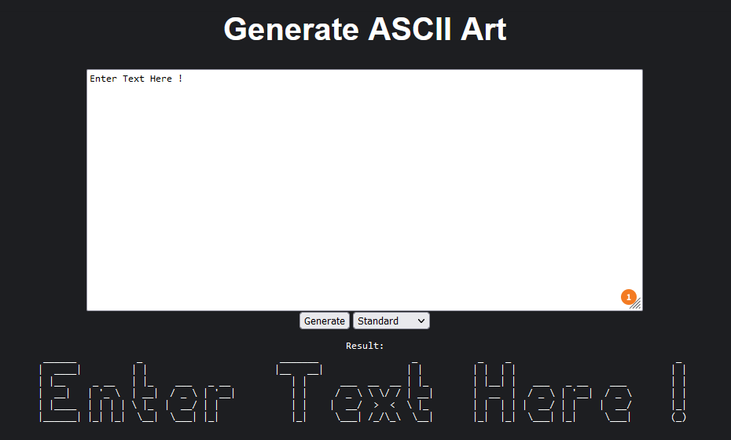

## ascii-art-web

Ascii-art-web is a web application that allows you to convert text into ascii art. The application is dockerized and can be run in a container.

### Requirements

- [Docker](https://docs.docker.com/get-docker/)

### How to use

1. Build the image using `docker image build -t ascii-art-web-dockerize .` command. 
2. Then run the container using `docker container run -p 8080:8080 ascii-art-web-dockerize` command.
3. Then open `http://localhost:8080` in your browser. 
4. You will see the main page with the form to write the text.
5. After you submit the form, you will see the ascii art of the text you wrote.

### How to change port

If you want to change the port, you need to change the port in the `Dockerfile` and in the `main.go` file.
Then you need to rebuild the image and run the container again with the new port.

### How to stop the container

To stop the container, you need to run `docker container stop <container_id>` command. You can find the container id by running `docker container ls` command.

### How to remove the image

To remove the image, you need to run `docker image rm <image_id>` command. You can find the image id by running `docker image ls` command.